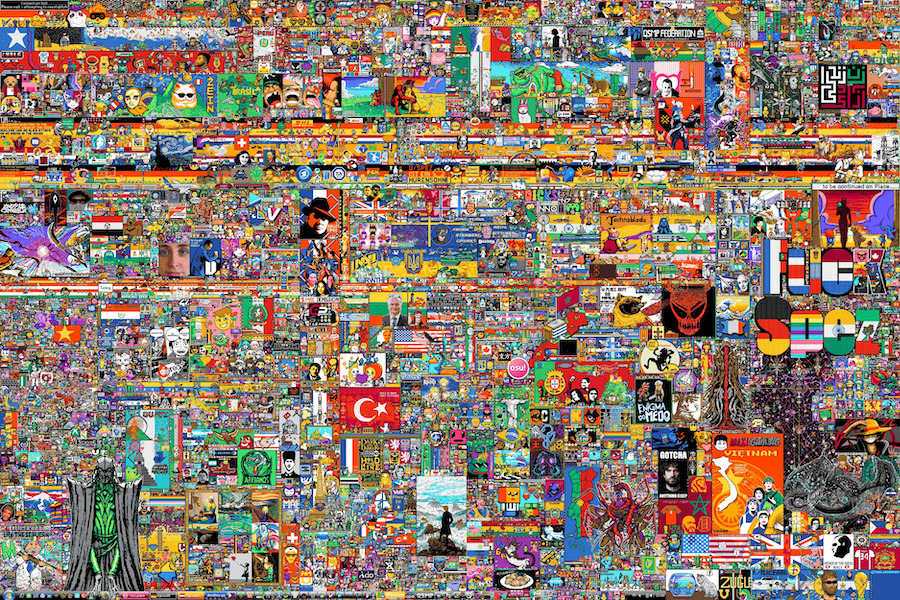
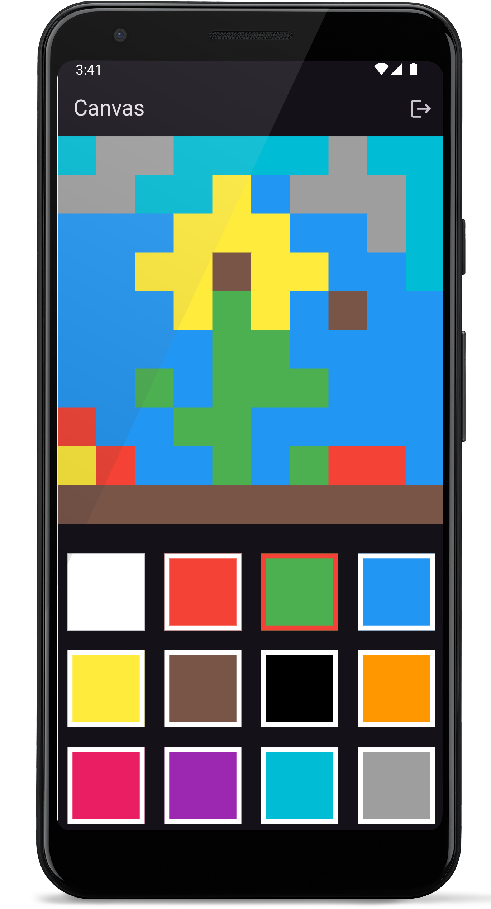

[](https://classroom.github.com/a/Xx7Js_b8)
# AoP SS2026 - Assignment09 (20 Punkte)

Auch dieses Assignment ist im Team zu zweit zu bearbeiten, bitte mit einer anderen Person als Assignment08!

"_Place (offiziell `r/place`) ist ein wiederkehrendes Gemeinschaftsprojekt und soziales Experiment des sozialen Netzwerks Reddit._

_Registrierte User können auf der Seite ein Pixelfeld bearbeiten, indem sie die Farbe eines einzelnen Pixels durch Auswählen aus einer 16-Farben-Palette ändern. Nachdem ein Pixel platziert wurde, hindert ein Timer den User für einen Zeitraum von 4 bis 5 Minuten daran, weitere Pixel zu platzieren._

_Das erste Experiment wurde am 1. April 2017 von Reddit-Administratoren als Aprilscherz gestartet und etwa 72 Stunden nach seiner Erstellung am 3. April 2017 beendet. Über 1 Million Benutzer bearbeiteten die Leinwand und platzierten insgesamt etwa 16 Millionen Kacheln. Als das Projekt beendet wurde, waren über 90.000 Benutzer aktiv._"

https://de.wikipedia.org/wiki/Place_(Reddit)



#### Abbildung 01: Der Canvas 2023 kurz vor Ende des Events. (Bildquelle: https://en.wikipedia.org/wiki/R/place)

Im Rahmen dieses Assignments soll eine simple Version von `r/place` (ohne Timer und mit kleinerem Canvas) nachgebaut werden. Im Repository findet sich ein kurzes Video mit einer möglichen Lösung, außerdem ist das UI schon vorgegeben.

Die fertige App kann z.B. so aussehen:



#### Abbildung 02: Der Canvas Screen (mit Logout Button in der AppBar, Canvas und Farbpalette).

## Backend

Für das Backend kann `Supabase` oder ein anderer vergleichbarer Anbieter benutzt werden. Weitere Infos dazu finden sich in Vorlesung 10.
Im Repository sind die Stellen, an denen ihr eine Anbindung an das Backend implementieren müsst mit Kommentaren und `TODO` markiert.

### Login, SignUp und Logout

Die App soll nur für registrierte User nutzbar sein (Einstellungen in `Supabase` vgl. Vorlesung).
Daher muss die App sowohl einen funktionierenden SignUp- also auch einen Login/SignIn-Screen enthalten.
Außerdem muss es eine Möglichkeit geben, sich wieder auszuloggen.

Das Interface für LoginScreen und SignUpScreen ist im Repository vorgegeben.
Die Anbindung an die Datenbank ist eure Aufgabe, die entsprechenden Stellen sind im Code markiert.
Das vorgegebene Interface dürft ihr natürlich anpassen und verbessern, wenn ihr möchtet.

Implementiert wie in der Vorlesung besprochen `AuthService` (für die Methoden `signUpNewUser`, `signInWithEmail`, `signOut`) und `AuthGate` (für die Anzeige von LoginScreen und CanvasScreen je nach Status der Authentifizierung).

### Cloud-Datenbank: Authentifizierung

Da alle User der App auf dem gleichen Canvas malen, muss es im Backend eine Möglichkeit zum Speichern der Farben der einzelnen Pixel geben. Wir brauchen also eine Datenbank, die wir in `Supabase` anlegen können (siehe Vorlesung).
Für das Speichern der Pixel-Farben legt ihr über `Supabase` wie in der Vorlesung gezeigt eine neue Datenbank-Tabelle an, wir brauchen ein Feld für eine `id` und ein Feld für eine `color`.
Beide Werte wollen wir als `int8` speichern, beide wollen wir im Code befüllen (sie sollen also nicht automatisch gesetzt werden).

### Cloud-Datenbank: Daten speichern

Analog zum `AuthService` zur Verwaltung der Datenbank-Authentifizierung implementieren wir einen `DatabaseService`, der das Speichern unserer Daten verwaltet.
Hier wollen wir die gefärbten Pixel in die Datenbank speichern und wieder abrufen können.
Den `int8`-Wert zum Abspeichern in `supabase` erhaltet ihr in Dart über die Methode `Color.toARGB32()`.

Der `DatabaseService` für das Lesen und Schreiben der Datenbank-Tabelle kann ungefähr so aussehen:

```dart
import 'package:flutter/material.dart';
import 'package:supabase_flutter/supabase_flutter.dart';

class DatabaseService {
  // TODO: this name has to be the name of your supabase table!
  static const tableName = 'pixels';

  // Get a reference your Supabase client
  final supabase = Supabase.instance.client;

  // Save information on one Pixel in database
  Future<void> setPixel(int id, Color color) async {
    int colorAsInt = color.toARGB32();
    Map<String, int> data = {'id': id, 'color': colorAsInt};

    // use upsert to insert data if id doesn't exist yet und update data if id already exists
    await supabase.from(tableName).upsert(data);
  }

  // Get saved data from database (complete table)
  Stream getPixelStream() {
    Stream stream = supabase.from(tableName).stream(primaryKey: ['id']);
    return stream;
  }
}
```

## Frontend

### Screens und Navigation

Das Repository enthält die folgenden Screens:

- Login-Screen
- SignUp-Screen
- Canvas-Screen

Der CanvasScreen darf nur für erfolgreich eingeloggte User erreichbar sein.
Beim Logout wird automatisch zum Login-Screen zurückgeleitet.

Die Authentifizierung implementiert ihr über die Cloud-Datenbank (siehe oben/Vorlesung: `AuthService` und `AuthGate`).

### Der Canvas

Auf dem Canvas-Screen bietet eine Farbpalette mehrere Farben zur Auswahl an.
Es ist im UI klar ersichtlich, welche Farbe gerade ausgewählt ist (roter Rahmen).

Der eigentliche Canvas besteht aus 10x10 "Pixeln", wobei jeder "Pixel" eigentlich nur ein `Container`-Widget in einem `GridView`-Widget ist (siehe `PixelGrid`-Widget).
Beim Klick auf einen "Pixel" wird dieser in der aktuell ausgewählten Farbe eingefärbt.

Diese Farbänderung muss von euch in der Cloud-Datenbank persistiert werden (über die `databaseService.setPixel(index, currentColor)`, siehe oben).

Die Daten müssen im Frontend automatisch jedes Mal abgerufen werden, wenn sich an den Daten etwas geändert hat.

Dafür könnt ihr die Methode `databaseService.getPixelStream()` (siehe oben) nutzen.
Auf die Änderungen im Pixel-Stream wollen wir "lauschen":

```dart
  stream.listen((snapshot) {
     // update the colored pixels with the snapshot data

     // TODO: iterate over snaphsot entries, get id and color

     // with id and color from the database (currentId and currentColorAsInt) you can then update your PixelGrid-Colors
     Color currentColor = Color(currentColorAsInt);
     if (currentColors[currentId] != currentColor) {
        setState(() {
          print('different color at $currentId');
          currentColors[currentId] = currentColor;
        });
      }
  });
```

Wird auf einem zweiten Gerät ein Pixel umgefärbt, so sind diese Änderungen auch unmittelbar auf dem eigenen Gerät zu sehen (siehe Video im Repository).

### Kommunikation von Fehlern

Eure einzige Aufgabe im Frontend ist die Umsetzung von Error-Handlung inkl. Kommunikation mit Usern.
Wenn z.B. keine Internetverbindung besteht, das eingegebene Passwort falsch ist, kein User zur angegebenen Mail-Adresse existiert, die beiden Passwörter zum Registrieren nicht übereinstimmen oder ähnliches, muss das Problem den Usern verständlich kommuniziert werden (z.B. in einer SnackBar wie in der `logout`-Methode im CanvasScreen).
Eine Liste von Error-Codes der Supabase-Authentication findet ihr hier: https://supabase.com/docs/guides/auth/debugging/error-codes#auth-error-codes-table

## Weitere Anforderungen

Der vorgegeben Code soll vollständig kommentiert und verstanden werden.
Wir korrigieren eure Abgaben asynchron und geben euch Feedback über GRIPS.

Neben dem Quellcode soll dieses Mal auch eine APK-Datei mit abgegeben werden (siehe Vorlesung).
Es reicht, diese vor der Abgabe mit in das Repository hochzuladen. Achtet unbedingt dabei, dass sich die APK-Datei vor der Deadline auch wirklich im Remote-Repository auf GitHub widerfindet!

Es gelten die gleichen Regeln wie bei Assignment08 für das Arbeiten im Team mit Git und GitHub (Branches, Pull Requests, etc.)!
Auch das werden wir bei der Korrektur bewerten.

Die Aufgabenverteilung im Team muss im folgenden Abschnitt dokumentiert werden.

## Dokumentation der Aufgabenverteilung

Aufgaben Teammitglied 1: {Name hier einfügen}

- {Aufgabe 1}
- {Aufgabe 2}
- {Aufgabe 3}
- {Aufgabe 4}
- {...}

Aufgaben Teammitglied 2: Daniel

- Database Service für Supabase
- Echtzeit Synchronisation im Pixel Grid
- Farbspeicherung
- APK (noch nicht gemacht, aber ganz am Ende werde ich es machen)

## Checkliste für das Assignment

- [x] In der App kann man sich als User mit Mail-Adresse und Passwort registrieren.
- [x] Nach Registrierung ist auch ein Login mit den gleichen Daten möglich.
- [x] Der Canvas-Screen ist nur als eingeloggter User erreichbar.
- [x] Auf dem Canvas-Screen kann man sich auch wieder aus der App ausloggen.
- [x] Änderungen am Canvas sind für alle User der App, auch auf verschiedenen Smartphones sofort sichtbar (sofern natürlich eine Internetverbindung besteht).
- [x] Die App setzt korrektes Error-Handling um. Egal, ob fehlende Internetverbindung, falsches Passwort beim Login, etc. Der User soll stets bei Problemen mit nicht-technischen und klar verständlichen Beschreibungen über diese informiert werden.
- [x] Im Repository findet sich neben dem Code eine APK-Datei der fertigen App.
- [x] Der vorgegebene Code ist verstanden und kommentiert.
- [x] Die App darf nicht abstürzen oder "einfrieren".
- [x] Der Code ist modular aufgebaut, angemessen kommentiert und korrekt formatiert. Toter oder doppelter Code wurde vor der Abgabe entfernt.
- [x] Die Aufgabenverteilung im Team ist fair (beide Teammitglieder erledigen ca. 50% der Arbeit. **Nicht**: _"A hat nur das Design gemacht und B den Rest"_).
- [x] Die Aufgabenverteilung im Team wurde in dieser Readme-Datei dokumentiert.
- [x] Alle Features wurden auf eigenen Feature-Branches implementiert.
- [x] Für Branches mit fertig implementierten Features wurden Pull-Requests gestellt, aber nicht selbst beantwortet.
- [x] Alle relevanten Branches wurden auf den main-Branch gemerged (**Wichtig:** Nur der Code auf diesem Branch wird bewertet!).
- [x] Alle Änderungen am Code sind durch regelmäßige Commits mit aussagekräftigen Commit-Messages dokumentiert und auf das Remote-Repository auf GitHub gepusht worden.

## Optionale Erweiterungen

- Ein Timer wie beim originalen `r/place`, der nur alle X Sekunden eine Änderung am Canvas erlaubt
- Anzahl der geänderten Pixel je User in der Cloud-Datenbank protokollieren
- Verschönerungen am Interface
- Eure eigenen Ideen für Erweiterungen :)
